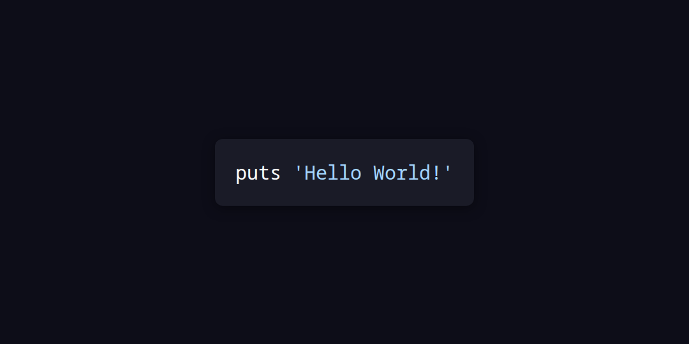

```
mkdir code-image-api && cd code-image-api
npm init -y
npm install express puppeteer highlight.js
node server.js
```

```
curl --request POST \
  --url http://localhost:3000/generate \
  --header 'Content-Type: application/json' \
  --data '{
	"language": "ruby",
	"code": "puts 'Hello World!'"
}'
```

